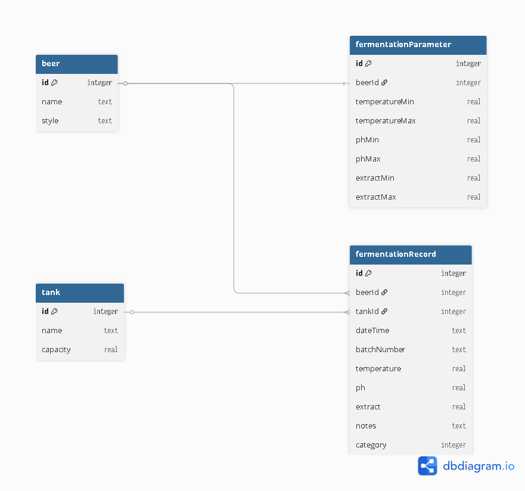

# Brewery Fermentation Control — Backend

API RESTful desenvolvida em **C#/.NET 8** para controle de fermentação cervejeira, permitindo o registro e acompanhamento de parâmetros fermentativos com classificação automática de qualidade.

---

## Tecnologias

- .NET 8
- ASP.NET Core Web API
- Entity Framework Core
- SQLite
- MediatR — padrão CQRS
- Swagger/OpenAPI — documentação dos endpoints

---

## Arquitetura

O projeto segue o padrão **CQRS (Command Query Responsibility Segregation)** utilizando **MediatR**, separando as operações de leitura (**Queries**) das operações de escrita (**Commands**).

Essa abordagem melhora a organização do código, facilita a manutenção e torna a aplicação mais escalável.

```
FermentationControl.Api/
├── Controllers/               # Endpoints da API
├── Data/                      # AppDbContext (EF Core)
├── DTOs/                      # Objetos de transferência de dados
│   ├── Beer/
│   ├── Dashboard/
│   ├── FermentationParameter/
│   ├── FermentationRecord/
│   └── Tank/
├── Entities/                  # Entidades do banco de dados
├── Enums/                     # Enumerador para classificação das categorias
├── Features/                  # CQRS — Commands e Queries
│   ├── Beer/
│   ├── Dashboard/
│   ├── FermentationParameter/
│   ├── FermentationRecord/
│   └── Tank/
├── Migrations/                # Migrations do EF Core
└── Services/                  # Regras de negócio
```

---

## Banco de Dados

A aplicação utiliza o **SQLite** como banco de dados relacional, com persistência de dados realizada por meio do **Entity Framework Core** utilizando a abordagem **Code First**.

O esquema do banco é gerenciado por **migrations**, permitindo a criação e atualização das tabelas de forma automatizada.


### Modelo de Dados



## Regra de Negócio

### Classificação Automática de Registros

Cada cerveja possui parâmetros fermentativos cadastrados com **faixa cadastrada** (mínimo e máximo) e **tolerância** para cada parâmetro (temperatura, pH e extrato).

| Parâmetro | Faixa Cadastrada | Tolerância |
|---|---|---|
| Temperatura | 18°C a 22°C | ±2°C |
| pH | 4,2 a 4,8 | ±0,4 |
| Extrato | 11°P a 13°P | ±2°P |

Ao salvar um registro fermentativo, o sistema classifica automaticamente:

- 🟢 **Dentro do Padrão** — todos os parâmetros estão dentro da faixa cadastrada (entre mínimo e máximo).
- 🟡 **Atenção** — pelo menos um parâmetro está fora da faixa cadastrada, mas todos permanecem dentro da faixa de tolerância.
- 🔴 **Fora do Padrão** — pelo menos um parâmetro ultrapassa a faixa de tolerância.

**Exemplo:** com os parâmetros da tabela acima, um registro com temperatura de **17°C**, pH **4,3** e extrato **11°P** será classificado como 🟡 **Atenção**, pois apenas a temperatura está fora da faixa cadastrada (17 < 18), mas ainda dentro da tolerância (17 ≥ 18 - 2 = 16).

---

## Funcionalidades

- ✅ Cadastro de cervejas
- ✅ Cadastro de tanques
- ✅ Cadastro de parâmetros fermentativos por cerveja
- ✅ Registro de registros fermentativos com classificação automática
- ✅ Dashboard com indicadores gerais
- ✅ Histórico de lotes com evolução cronológica

---

## Pré-requisitos

Antes de executar o projeto, certifique-se de ter instalado:

- [.NET 8 SDK](https://dotnet.microsoft.com/download/dotnet/8.0)
- [Git](https://git-scm.com/)

---

## Como executar

### 1. Clonar o repositório

```bash
git clone https://github.com/seu-usuario/brewery-fermentation-control.git
cd brewery-fermentation-control
```

### 2. Navegar até o projeto backend

```bash
cd backend/FermentationControl/FermentationControl.Api
```

### 3. Restaurar as dependências

```bash
dotnet restore
```

### 4. Aplicar as migrations (cria o banco de dados automaticamente)

```bash
dotnet ef database update
```

> O arquivo `brewery.db` será criado automaticamente na raiz do projeto.

### 5. Executar o projeto

```bash
dotnet run
```

### 6. Acessar o Swagger

Abra o navegador e acesse:

```
http://localhost:5107/swagger
```

> A porta pode variar. Verifique no terminal a URL exibida após `Now listening on:`.

---

## Endpoints

### Beer
Gerenciamento de cervejas.

| Método | Rota | Descrição |
|---|---|---|
| `GET` | `/api/beer` | Lista todas as cervejas |
| `POST` | `/api/beer` | Cadastra uma nova cerveja |

### Tank
Gerenciamento de tanques.

| Método | Rota | Descrição |
|---|---|---|
| `GET` | `/api/tank` | Lista todos os tanques |
| `POST` | `/api/tank` | Cadastra um novo tanque |

### FermentationParameter
Gerenciamento dos parâmetros fermentativos.

| Método | Rota | Descrição |
|---|---|---|
| `GET` | `/api/fermentationparameter/{beerId}` | Busca parâmetros de uma cerveja |
| `POST` | `/api/fermentationparameter` | Cadastra parâmetros de uma cerveja |

### FermentationRecord
Gerenciamento dos registros fermentativos.
| Método | Rota | Descrição |
|---|---|---|
| `POST` | `/api/fermentationrecord` | Registra um apontamento fermentativo |
| `GET` | `/api/fermentationrecord/batch/{batchNumber}` | Histórico de registros de um lote |

### Dashboard
Indicadores gerais do sistema.
| Método | Rota | Descrição |
|---|---|---|
| `GET` | `/api/dashboard` | Retorna indicadores gerais |
